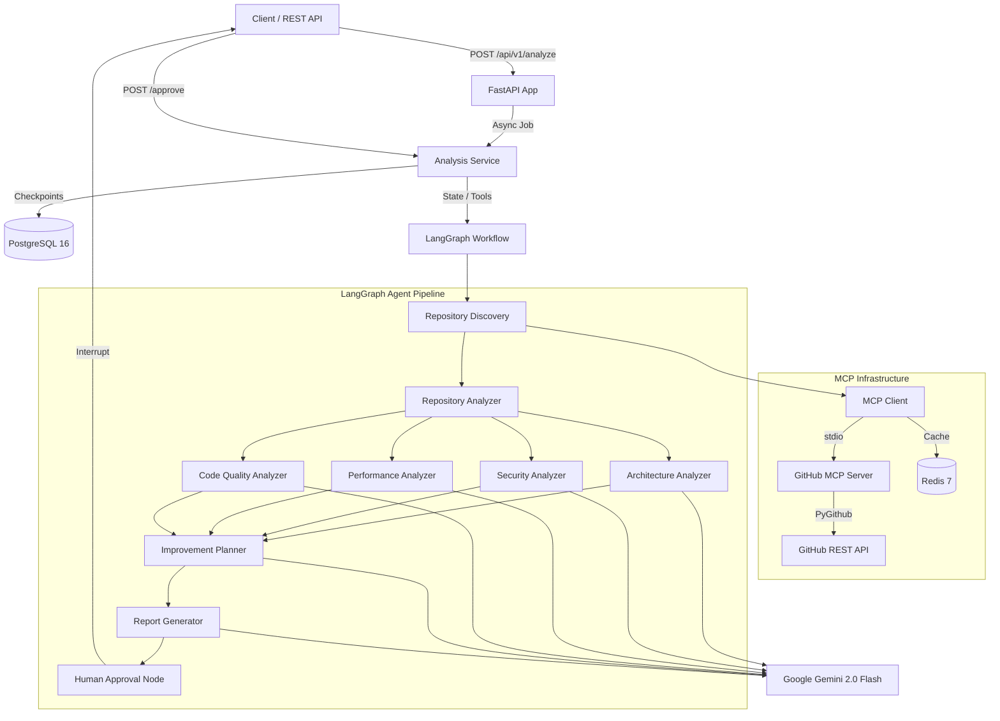

# AI GitHub Repository Architect — Architecture Specification

## Overview

The **AI GitHub Repository Architect** is an autonomous AI agent system designed to analyze any public or private GitHub repository and produce an expert-level, detailed technical architecture report.

## System Architecture



---

## Component Breakdown

### 1. API & Orchestration Layer (`app/api`, `app/services`)
- **FastAPI**: Provides asynchronous REST API endpoints (`/api/v1/analyze`, `/api/health`, etc.).
- **AnalysisService**: Handles workflow state transitions, coordinates async job execution, manages database transactions, and invalidates Redis cache entries.

### 2. GitHub MCP Server (`app/mcp/github_server`)
- Spawns as a separate process using stdio transport.
- Exposes 9 specialized repository tools (`get_repository_info`, `get_directory_tree`, `get_file_content`, `search_repository`, `get_recent_commits`, `get_pull_requests`, `get_issues`, etc.).
- Shields LLMs from raw GitHub API interactions and rate limit mechanics.

### 3. LLM Abstraction Layer (`app/services/llm`)
- **LLMProvider**: Abstract base class enforcing model neutrality.
- **GeminiProvider**: Implementation using `langchain-google-genai` with prompt injection defense, structured JSON validation, and automatic corrective retry loops.

### 4. Agent Architecture (`app/agents`)
- **RepositoryDiscoveryAgent**: Scans directory tree, filters non-essential files, calculates relevance scores, and fetches high-priority source code.
- **RepositoryAnalyzerAgent**: Identifies primary technologies, framework entry points, and high-level project metadata.
- **ArchitectureAnalyzerAgent**: Evaluates component boundaries, structural patterns, and generates executable Mermaid flowchart diagrams.
- **SecurityAnalyzerAgent**: Audits code for secrets, authentication flaws, input validation risks, and security anti-patterns.
- **PerformanceAnalyzerAgent**: Detects N+1 query loops, missing pagination, blocking I/O, and unindexed database queries.
- **CodeQualityAnalyzerAgent**: Inspects SOLID principle adherence, god classes, test quality, and maintainability metrics.
- **ImprovementPlannerAgent**: Merges findings into a prioritized improvement matrix with effort/impact metrics and revision feedback support.
- **ReportGeneratorAgent**: Assembles the 20-section Markdown report.

---

## Database Schema (PostgreSQL)

```
+-------------------------------------------------------------+
|                          analyses                           |
+-------------------------------------------------------------+
| id (UUID, PK)                                               |
| repository_url (VARCHAR)                                    |
| repository_name (VARCHAR)                                   |
| owner (VARCHAR), repo (VARCHAR)                             |
| status (VARCHAR: STARTED|RUNNING|AWAITING_APPROVAL|...)     |
| current_node (VARCHAR)                                      |
| repository_metadata (JSONB)                                 |
| repository_summary (JSONB)                                  |
| architecture_analysis (JSONB)                             |
| security_analysis (JSONB)                                 |
| performance_analysis (JSONB)                              |
| code_quality_analysis (JSONB)                               |
| improvement_recommendations (JSONB)                        |
| errors (JSONB), warnings (JSONB)                            |
| created_at, updated_at, completed_at (TIMESTAMP)            |
+-------------------------------------------------------------+
                              |
                              | 1:1
                              v
+-------------------------------------------------------------+
|                           reports                           |
+-------------------------------------------------------------+
| id (UUID, PK)                                               |
| analysis_id (UUID, FK -> analyses.id)                       |
| content (TEXT)                                              |
| word_count (INT)                                            |
| report_metadata (JSONB)                                     |
| created_at, updated_at (TIMESTAMP)                          |
+-------------------------------------------------------------+
                              |
                              | 1:N
                              v
+-------------------------------------------------------------+
|                          feedback                           |
+-------------------------------------------------------------+
| id (UUID, PK)                                               |
| analysis_id (UUID, FK -> analyses.id)                       |
| action (VARCHAR: APPROVE|REJECT|REQUEST_REVISION)           |
| feedback_text (TEXT)                                        |
| revision_instructions (TEXT)                                |
| revision_number (INT)                                       |
| created_at (TIMESTAMP)                                      |
+-------------------------------------------------------------+
```

---

## Security & Reliability Principles

1. **Untrusted Data Isolation**: File contents and README files from external repositories are treated strictly as untrusted data. Prompts sanitize trigger phrases and enforce strict system instruction boundaries.
2. **Deterministic Schemas**: All agent outputs are validated against Pydantic models before being merged into the state graph.
3. **Resilient Rate Limiting**: Redis caches GitHub API payloads (1-hour TTL) and expensive LLM analysis results (24-hour TTL) to prevent throttling.
4. **Exponential Backoff**: Transient errors (HTTP 429, network timeouts) trigger automatic retry loops with jitter.
